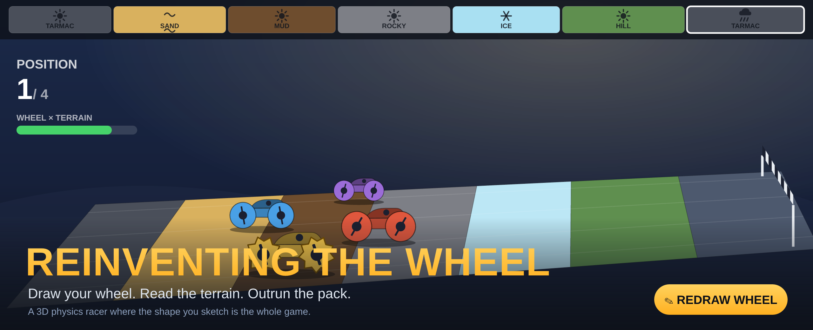
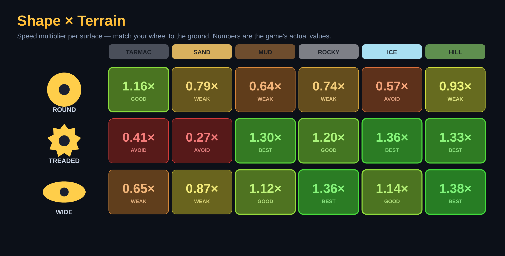

<h1 align="center">Reinventing the Wheel</h1>

<b>Draw your wheel. Read the terrain. Outrun the pack.</b>

A 3D side-on physics racer with one twist that *is* the whole game: you don't
pick a car, you **draw its wheels by hand**. Sketch a closed loop, and that
profile is extruded into the four wheels your car rolls on. The shape you draw
decides how fast and grippy you are on whatever's under you — tarmac, sand, mud,
rock, ice, a hill climb — so when the terrain changes, you redraw to adapt.
Race left-to-right against three AI drivers to the finish line.

It's a single self-contained **`index.html`** — no build step, no bundler, no
framework. [Three.js](https://threejs.org/) renders, [Rapier3D](https://rapier.rs/)
(the `compat` build, WASM inlined) runs the physics, both pulled from a CDN via
an ES-module import map. Drop it on GitHub Pages and it just runs, on desktop or
a phone.

## Draw a wheel mid-race

Tap **Redraw** and time slows to a crawl while a sketch pad opens. Draw one
closed loop — your wheel's side profile — and **Materialise** it. The stroke is
cleaned up (Douglas–Peucker), normalised so size never matters (only *shape*
does), extruded, and snapped onto all four wheels with a little pop.

- **Round &amp; smooth** → fast on hard tarmac, useless in the slop.
- **Spiky / treaded** → bites mud, snow, ice, and climbs — but bumpy and slow on tarmac.
- **Wide &amp; fat** → floats over sand and rolls over rock; narrow shapes dig in and bog.

Redrawing costs ~1.2s of cut power while the new wheels materialise, so you swap
**tactically**, reading the telegraph strip up top to plan for the next zone —
not spamming it.

 

## The heart of it: shape × terrain

Every surface has a winning shape, computed analytically. These are the game's
**actual** speed multipliers — the balance lives in two small, heavily-commented
functions (`geometryToProfile` reads roundness / tread / width off your drawing;
`shapeTerrainMultiplier` turns shape × terrain × weather into one number):

Weather flips things on the fly: **rain** kills the round-wheel advantage on
tarmac, **snow** rewards tread on top of any surface, **heat** bakes mud hard so
smooth wheels start winning again. The strip at the top of the screen telegraphs
both the terrain and the weather coming up, so a good redraw is a *prediction*.

## Run it

Open `index.html` over any static server, or visit the GitHub Pages deployment.
To publish: **Settings → Pages → Deploy from branch → root**. Nothing to build —
it's one HTML file plus the CDN modules.

## Performance & internals

Built to hold up on a phone: capped `devicePixelRatio`, one directional light +
ambient, flat low-poly art, a single trimesh ground, reused geometry, and a
fixed-timestep physics loop decoupled from rendering. The car is a single stable
body with four wheels spun deterministically from speed, and a three-quarter
chase cam (behind, offset, low) that keeps your spinning wheels *and* the whole
pack in frame.
